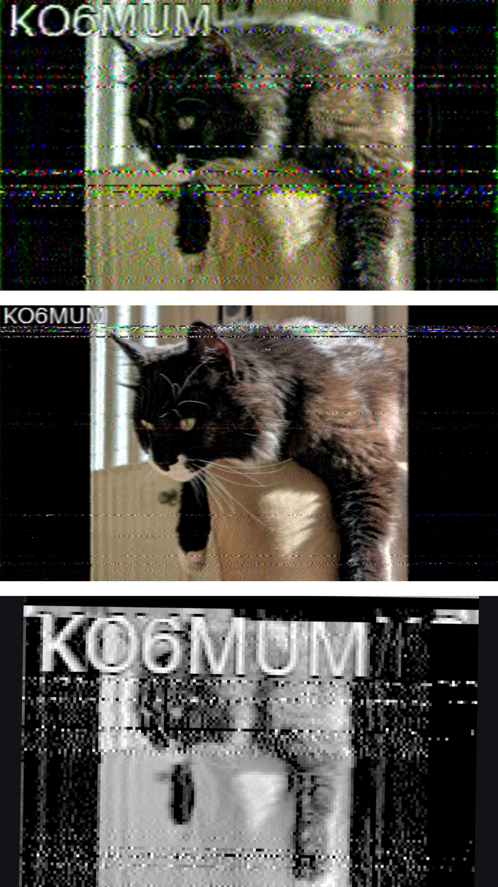

# Analog Modes

Any analog modes that the boat uses will go here.

# SSTV library

Run `import sstv` in your script

Then, when you have a PIL image object, put it in an encoder function. Possible options are:

`out = sstv.gray8(image, "callsign")` which takes 8 seconds to tx but is grayscale. If you are decoding with the Robot36 app, just switch it to raw mode for this.

`out = sstv.Robot36(image, "callsign")` 36 seconds, with color

`out = sstv.PD120(image, "callsign")` 120 seconds roughly with color, higher resolution but takes more time.

Then, to store `out` to a wav file, add `out.write_wav("filename.wav")`

If you don't want to do this, you can use it as an audio thingy object.

Here is an example of all modes in a picture:

